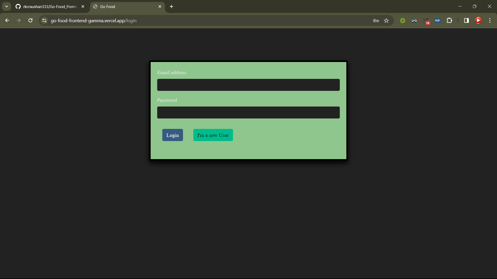
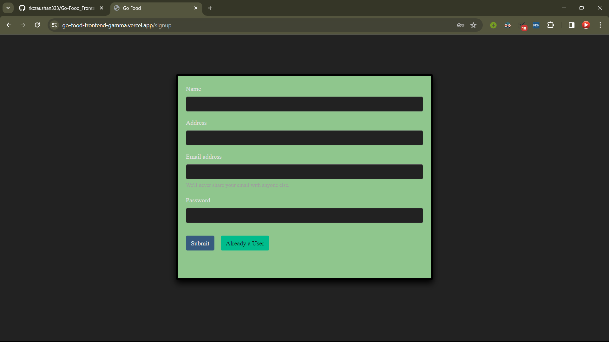
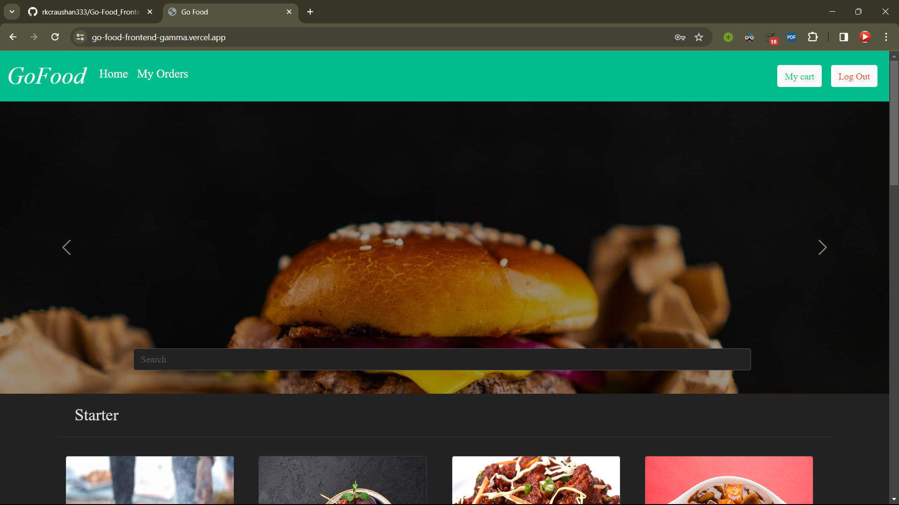
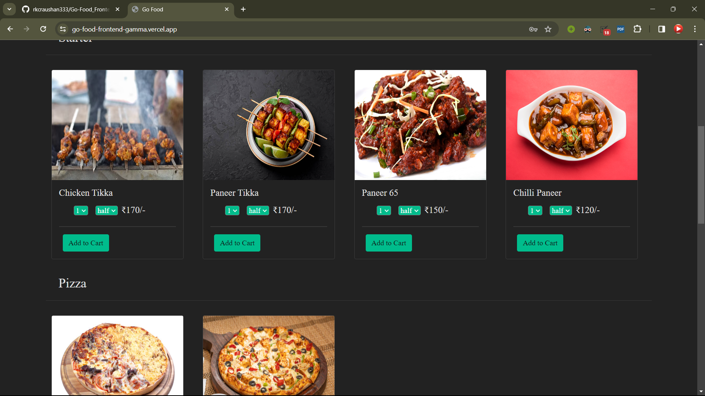
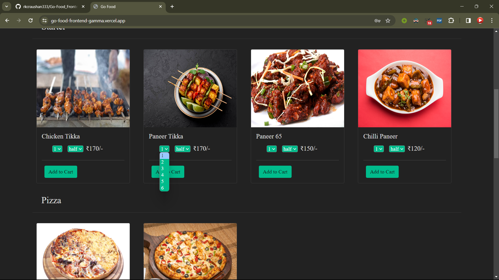
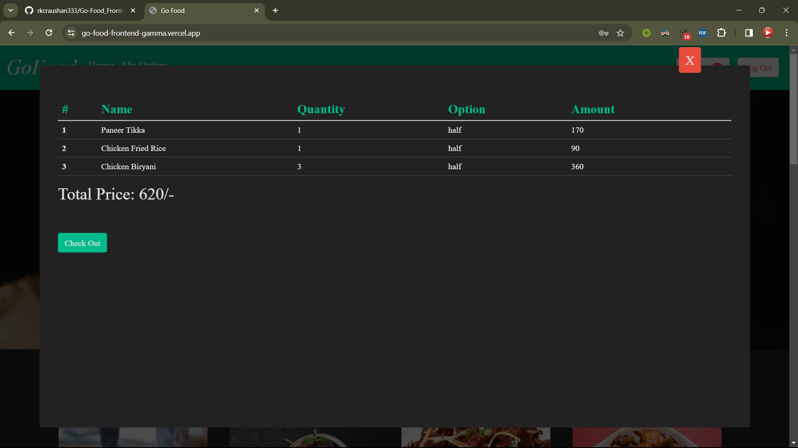

# A responsive UI using ReactJS and Bootstrap for an engaging food delivery web app, ensuring compatibility across diverse devices.

# Implemented robust user authentication with JavaScript, JWT, and bcrypt, prioritizing data security for userregistrations and logins

# Crafted a backend infrastructure with Node.js, Express.js, and MongoDB (Mongoose), enabling efficient data management and RESTful API development

# Login Page

# Signup Page

# Home Page

# products

# Functionalities

# Cart

